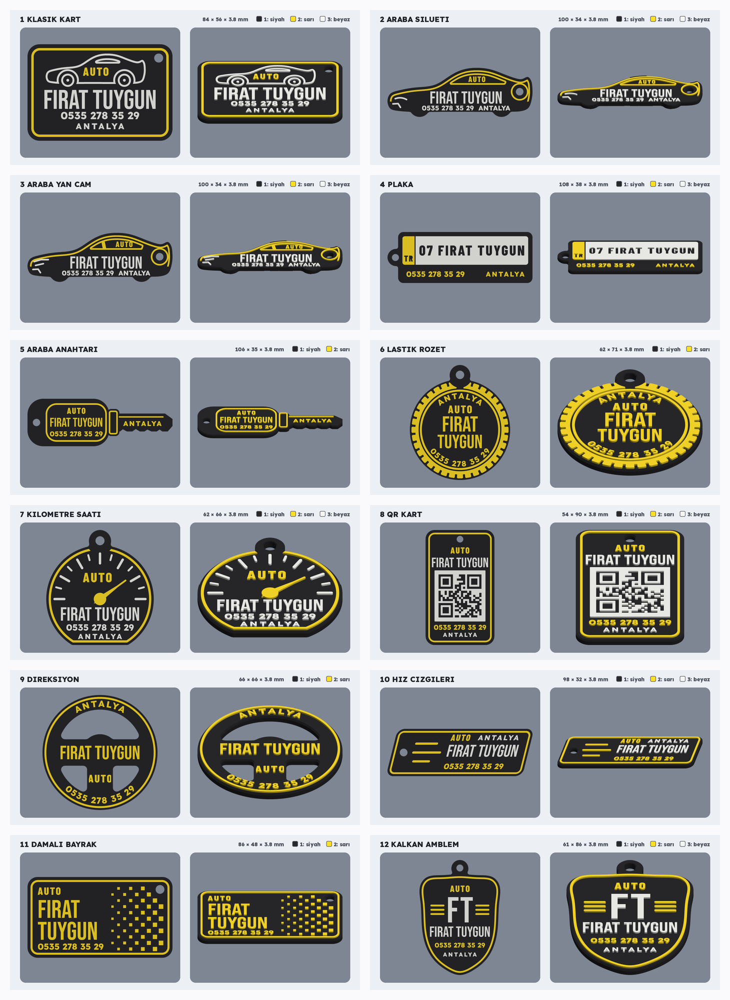

# AUTO FIRAT TUYGUN anahtarlıkları (Bambu Lab X2D)



Yalnızca yeni beş tasarım: [`onizleme/yeni_tasarimlar.png`](onizleme/yeni_tasarimlar.png)

Her `.3mf` dosyası Bambu Studio'da doğrudan açılıp dilimlenebilir. Tek parça, desteksiz basılır.

| Dosya | Ölçü (mm) | Renkler | Açıklama |
| --- | --- | --- | --- |
| `1_klasik_kart.3mf` | 84 × 56 | siyah + sarı + beyaz | Fotoğraf 1 (mavi → sarı): sarı çerçeve ve AUTO, beyaz çizgi araba ve yazılar |
| `2_araba_silueti.3mf` | 100 × 34 | siyah + sarı + beyaz | Fotoğraf 2: sarı kontur, cam ve AUTO; beyaz farlar, isim, telefon |
| `3_araba_yan_cam.3mf` | 100 × 34 | siyah + sarı + beyaz | Fotoğraf 3: direkli yan cam; köşeli farlar |
| `4_plaka.3mf` | 107 × 38 | siyah + sarı + beyaz | Galeri plaka çerçevesi: beyaz plaka, oyma siyah "07 FIRAT TUYGUN", sarı TR şeridi |
| `5_araba_anahtari.3mf` | 106 × 35 | siyah + sarı | Araba anahtarı: kumandada AUTO, isim, telefon; anahtar dilinde ANTALYA |
| `6_lastik_rozet.3mf` | 62 × 71 | siyah + sarı | Blok dişli lastik, kavisli ANTALYA ve telefon |
| `7_kilometre_saati.3mf` | 62 × 66 | siyah + sarı + beyaz | Beyaz çentikler ve yazılar, sarı ibre ve kenar |
| `8_qr_kart.3mf` | 54 × 90 | siyah + sarı + beyaz | **Okutunca galeriyi arayan QR kod** (TEL:+905352783529), isim, telefon |
| `9_direksiyon.3mf` | 66 × 66 | siyah + sarı | Üç kollu direksiyon, gerçek açıklıklar; anahtarlık halkası üst açıklıktan geçer |
| `10_hiz_cizgileri.3mf` | 98 × 32 | siyah + sarı + beyaz | Eğik kart, hız çizgileri, italik isim |
| `11_damali_bayrak.3mf` | 86 × 48 | siyah + sarı | Sağa doğru pikselleşen damalı bayrak, iki satır isim |
| `12_kalkan_amblem.3mf` | 61 × 86 | siyah + sarı + beyaz | Kalkan amblem, büyük FT monogramı ve yan şeritler |

## Katmanlar

| Parça | Filament | Yükseklik |
| --- | --- | --- |
| Gövde | 1 – siyah | 0 – 3,0 mm |
| Kabartma | 2 – sarı, 3 – beyaz | 3,0 – 3,8 mm (4 katman) |

Ayarlar önceki X2D projesinden: **Bambu Lab X2D 0.4, Bambu PLA Basic, 0.20 mm Standard**.

## 3D baskı için yapılan iyileştirmeler

- **Küçük yazılar kalın ve açık:** Telefon ve şehir **Lexend ExtraBold** ile yazıldı. Bu yazı tipi küçük boyda kalın kalıyor,
  "3, 5, 8" gibi rakamların iç boşlukları da kapanmıyor. En küçük yazı yaklaşık 3,4 mm. İsim (Bebas Neue) en az 7,5 mm,
  AUTO yazısı Barlow Condensed ExtraBold.
- **Ölçüler 0,4 nozula göre:** Çizgiler en az 1,0–1,4 mm, ibre ucu en az 1 mm. Ayrı parçalar arasında en az 0,6 mm boşluk
  var, kabartma gövde kenarına 1 mm'den fazla yaklaşmıyor. Bunlar betikte otomatik kontrol ediliyor.
- **Kenarlar:** İlk katman 0,3 mm içe çekik (fil ayağı yapmaz). Gövdenin üst kenarında 3 katmanlık 0,6 mm pah var,
  elde daha düzgün hissettirir.
- **Arachne:** Nesne ayarı olarak *Arachne* duvar üretici açık. İnce yazıları daha düzgün basar.
- **Kabartma 0,8 mm:** Harfler daha az ip çeker, renk değişimi yalnızca son 4 katmanda olur.
- **Anahtarlık deliği:** 5,2–5,4 mm, etrafında en az 3,3 mm et payı var (betik ölçüyor).
- **QR kod:** Kareler 1,6 mm, beyaz zemin üzerinde siyah oyma; etrafında 2 karelik beyaz boşluk var. Betik QR'ı üstten
  görünüşten OpenCV ile okutup içeriğini doğruluyor. 3B görüntüde üstten, 25° ve 40° eğik açıdan da okundu.
- **Damalı bayrak:** Kareler köşeden değmiyor, aralarında en az 0,7 mm boşluk var; en küçük kare 1,3 mm.

## Yapılan kontroller (her üretimde)

Betik her tasarım için şunları raporlar:
- 0,7 mm'den ince kabartma alanı,
- 0,6 mm'den dar boşluk alanı (kalanlar N, Y, A gibi harflerin kendi sivri iç köşeleri),
- birbirine 0,6 mm'den yakın ayrı öğeler (hepsinde: yok),
- delik et payı,
- QR kodun okunup okunmadığı.

Ayrıca her 3MF'te parçaların kapalı ve sağlam katı olduğu, birbirinin içine girmediği, birlikte tek gövde oluşturduğu,
filament ayarlarının (renk sayısı, varyantlar, temizleme matrisi) parça atamalarıyla uyumlu olduğu kontrol edildi.

## Baskı

1. Dosyayı Bambu Studio'da aç. AMS eşleşmesini kontrol et: 3 renkli dosyalarda **1 = siyah, 2 = sarı, 3 = beyaz**;
   2 renkli dosyalarda 1 = siyah, 2 = sarı.
2. 3 renkli tasarımlarda iki filament aynı nozulu paylaşır (X2D'de iki nozul var). Son 4 katmanda renk değişimi ve
   temizleme kulesi olur, bu normal. En hızlı ve en az atıklı olanlar 2 renkli tasarımlardır (5, 6, 9 ve 11).
3. Çok adet basmak için nesneye sağ tıkla, *Örnek ekle*; sonra *Düzenle* ile tablaya yerleştir.
4. Dilimle → Yazdır.

## Yeniden üretme / değiştirme

```bash
pip install numpy manifold3d pillow shapely scipy fonttools uharfbuzz segno opencv-python-headless
python3 scripts/anahtarlik.py          # hepsi
python3 scripts/anahtarlik.py plaka    # yalnızca adında "plaka" geçen tasarım
```

İsim, telefon ve şehir `scripts/anahtarlik.py` dosyasının başındaki `NAME`, `PHONE`, `CITY` değişkenlerinden;
renkler `COLOURS`, kalınlıklar `BASE_H` / `RAISE_H` ile değiştirilir. Betik her tasarım için ince kabartma ve dar boşluk
alanlarını raporlar.

QR kod içeriği `QR_DATA` değişkenindedir; değiştirince betik yeni kodu okutarak doğrular.

Yazı tipleri: Bebas Neue, Barlow Condensed, Lexend (SIL Open Font License, `scripts/fonts/OFL-*.txt`).
