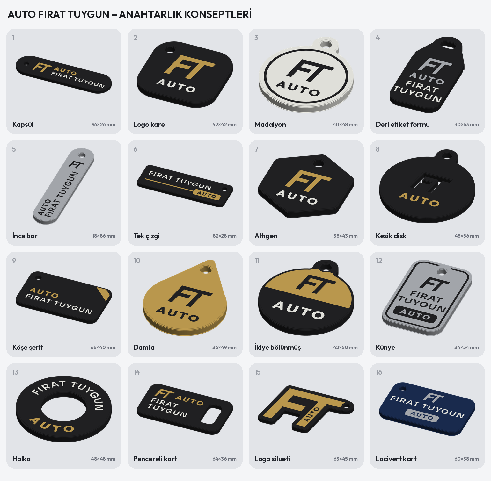

# AUTO FIRAT TUYGUN – kurumsal / minimalist anahtarlık konseptleri

Ayrıntılı sayfalar: [`hepsi.png`](hepsi.png) (marka sistemi + 1–6) · [`hepsi_2.png`](hepsi_2.png) (7–16) ·
her konsept ayrı: `1_kapsul.png` … `16_lacivert.png`

Önceki anahtarlıklar müşteriye kalabalık gelmişti. Bu konseptler yalnızca **görsel**; seçilen tasarım daha sonra baskıya
hazır Bambu Lab 3MF dosyasına çevrilecek.

## Yaklaşım

- **Tek marka sistemi:** FT monogramı (F ile T üst çizgiyi paylaşır, hafif eğik) + **belirgin AUTO** + Sora SemiBold
  isim. Bütün anahtarlıklarda aynı logo kullanılıyor.
- **AUTO öne çıkarıldı (galeri anahtarlığı):** AUTO artık her ön yüzde var. Outfit ExtraBold, isimle aynı boyda ya da
  daha büyük (4,0–5,4 mm), vurgu renginde ve ismin üstünde ("AUTO / FIRAT TUYGUN" diye okunur). Dar yüzeylerde
  (6, 12, 16) **AUTO rozeti** kullanılıyor: renkli dikdörtgenin içinde oyma harfler.
- **Ön yüz sade:** Yalnızca logo, AUTO ve isim, bolca boşluk. Telefon ve ANTALYA **arka yüzde**.
- **Az renk:** Mat siyah (ya da altın, gümüş, lacivert) zemin + tek vurgu. Yazılar yüzeyle aynı hizada (gömme renk).
  Ön yüz üst katmanlarda, arka yüz tablaya bakan ilk katmanlarda basılır.
- **Baskıya uygun ölçüler:** İsim en az 4,2 mm, küçük yazılar en az 3 mm (çizgiler ~0,6 mm ve üstü), öğeler kenardan
  en az 1 mm, delikten en az 0,8 mm içeride. Betikte kontrol edildi: kırpılan ya da çakışan öğe yok.

## Konseptler

| No | Ad | Ölçü | Renkler | Kısaca |
| --- | --- | --- | --- | --- |
| 1 | Kapsül | 96 × 26 mm | siyah, altın, beyaz | Hap biçimi; altın FT, büyük altın AUTO, altında beyaz isim |
| 2 | Logo kare | 42 × 42 mm | siyah, altın, beyaz | Uygulama ikonu gibi; büyük altın FT, altında beyaz AUTO |
| 3 | Madalyon | 40 × 48 mm | beyaz, siyah | Beyaz yuvarlak; ince siyah halka içinde siyah FT ve AUTO |
| 4 | Deri etiket formu | 30 × 63 mm | siyah, gümüş, beyaz | Bayi anahtarlığı biçimi; gümüş FT ve AUTO, iki satır isim |
| 5 | İnce bar | 18 × 86 mm | gümüş, siyah | Dikey ince bar; yan yana dikey AUTO ve isim, küçük FT |
| 6 | Tek çizgi | 82 × 28 mm | siyah, beyaz, altın | Beyaz isim; altın çizgi sağda AUTO rozetinde biter |
| 7 | Altıgen | 38 × 43 mm | siyah, altın, beyaz | Sivri tepeli altıgen; altın FT, beyaz AUTO |
| 8 | Kesik disk | 48 × 56 mm | siyah, altın, beyaz | FT işareti boydan boya kesik (içinden görünür), altın AUTO; arkada kavisli yazılar |
| 9 | Köşe şerit | 66 × 40 mm | siyah, altın, beyaz | Sağ üst köşede çapraz altın şerit; büyük altın AUTO, beyaz isim |
| 10 | Damla | 36 × 49 mm | altın, siyah | Altın damla; siyah FT ve AUTO |
| 11 | İkiye bölünmüş | 42 × 50 mm | siyah, altın, beyaz | Üst yarı altın (siyah FT), alt yarı siyah (büyük beyaz AUTO) |
| 12 | Künye | 34 × 54 mm | gümüş, siyah | Gümüş künye; siyah kenar çizgisi, FT, isim, siyah AUTO rozeti |
| 13 | Halka | 48 × 48 mm | siyah, beyaz, altın | Simit biçimi; anahtarlık ortadan geçer; üstte kavisli isim, altta büyük AUTO |
| 14 | Pencereli kart | 64 × 36 mm | siyah, altın, beyaz | Sağda halka penceresi; altın FT + AUTO, iki satır isim |
| 15 | Logo silueti | 63 × 45 mm | siyah, altın, beyaz | Anahtarlığın kendisi FT logosu; T'nin gövdesinde oyma dikey AUTO |
| 16 | Lacivert kart | 60 × 38 mm | lacivert, gümüş, beyaz | Ortalanmış: gümüş FT, beyaz isim, gümüş AUTO rozeti |

Önerilen filamentler: PLA Matte Charcoal (siyah), PLA Matte Ivory White (beyaz), PLA Basic Gold (altın),
PLA Basic Silver (gümüş), PLA Matte Dark Blue (lacivert).

Yeniden üretme: `python3 scripts/anahtarlik_konsept.py` (yalnız bazıları için: `python3 scripts/anahtarlik_konsept.py damla halka`)
