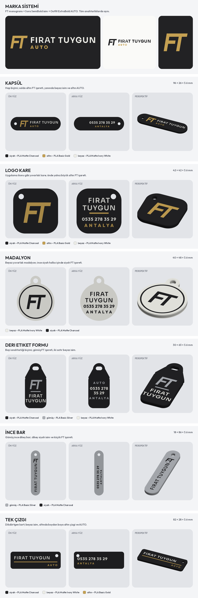

# AUTO FIRAT TUYGUN – kurumsal / minimalist anahtarlık konseptleri

Önceki anahtarlıklar müşteriye kalabalık gelmişti. Bu konseptler yalnızca **görsel**; seçilen tasarım daha sonra baskıya
hazır Bambu Lab 3MF dosyasına çevrilecek.

## Yaklaşım

- **Tek marka sistemi:** FT monogramı (F ile T üst çizgiyi paylaşır, hafif eğik) + Sora SemiBold isim +
  Outfit ExtraBold "AUTO". Bütün anahtarlıklarda aynı logo kullanılıyor.
- **Ön yüz sade:** Yalnızca logo ve isim, bolca boşluk. Telefon ve ANTALYA **arka yüzde**.
- **Az renk:** Mat siyah zemin + tek vurgu (altın, gümüş veya beyaz). Yazılar yüzeyle aynı hizada (gömme renk).
  Ön yüz üst katmanlarda, arka yüz tablaya bakan ilk katmanlarda basılır.
- **Baskıya uygun ölçüler:** İsim en az 4,4 mm, küçük yazılar en az 3 mm (çizgiler ~0,6 mm ve üstü), öğeler kenardan
  en az 1 mm içeride.

## Konseptler

| No | Ad | Ölçü | Renkler | Kısaca |
| --- | --- | --- | --- | --- |
| 1 | Kapsül | 96 × 26 mm | siyah, altın, beyaz | Hap biçimi; altın FT, beyaz isim, altın AUTO |
| 2 | Logo kare | 42 × 42 mm | siyah, altın, beyaz | Uygulama ikonu gibi; önde yalnız büyük altın FT |
| 3 | Madalyon | 40 × 48 mm | beyaz, siyah | Beyaz yuvarlak; ince siyah halka içinde siyah FT |
| 4 | Deri etiket formu | 30 × 63 mm | siyah, gümüş, beyaz | Bayi anahtarlığı biçimi; gümüş FT, iki satır isim |
| 5 | İnce bar | 18 × 86 mm | gümüş, siyah | Dikey ince bar; dikey isim, küçük FT |
| 6 | Tek çizgi | 82 × 28 mm | siyah, beyaz, altın | Beyaz isim, boydan boya altın çizgi, AUTO |

Önerilen filamentler: PLA Matte Charcoal (siyah), PLA Matte Ivory White (beyaz), PLA Basic Gold (altın),
PLA Basic Silver (gümüş).

Yeniden üretme: `python3 scripts/anahtarlik_konsept.py`
