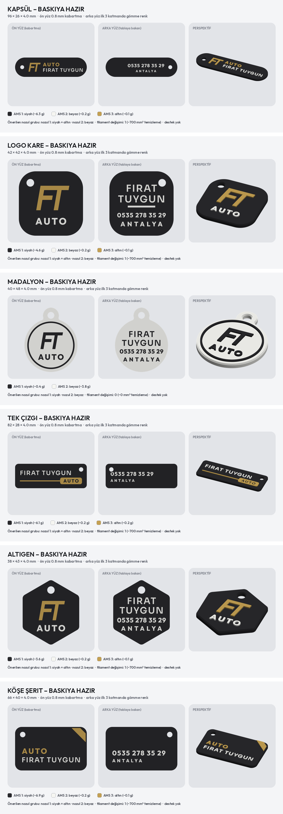
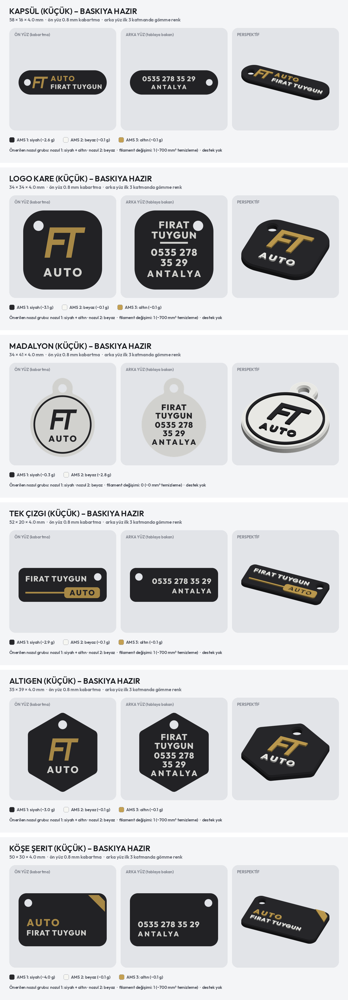

# AUTO FIRAT TUYGUN – kurumsal anahtarlıklar, baskıya hazır (Bambu Lab X2D)



Müşterinin seçtiği konseptler (1, 2, 3, 6, 7, 9). Her `.3mf` Bambu Studio'da doğrudan açılıp dilimlenebilir.
Tek parça, desteksiz basılır. Ayarlar: **Bambu Lab X2D 0.4, Bambu PLA Basic, 0.20 mm Standard**, Arachne duvar.

| Dosya | Ölçü (mm) | AMS sırası | Filament (yaklaşık) |
| --- | --- | --- | --- |
| `1_kapsul.3mf` | 96 × 26 × 4,0 | 1 siyah · 2 beyaz · 3 altın | 6,3 g + 0,2 g + 0,1 g |
| `2_logo_kare.3mf` | 42 × 42 × 4,0 | 1 siyah · 2 beyaz · 3 altın | 4,6 g + 0,2 g + 0,1 g |
| `3_madalyon.3mf` | 40 × 48 × 4,0 | 1 siyah · 2 beyaz | 0,4 g + 3,8 g |
| `6_tek_cizgi.3mf` | 82 × 28 × 4,0 | 1 siyah · 2 beyaz · 3 altın | 6,1 g + 0,2 g + 0,2 g |
| `7_altigen.3mf` | 38 × 43 × 4,0 | 1 siyah · 2 beyaz · 3 altın | 3,6 g + 0,2 g + 0,1 g |
| `9_kose_serit.3mf` | 66 × 40 × 4,0 | 1 siyah · 2 beyaz · 3 altın | 6,9 g + 0,2 g + 0,1 g |

Gramajlar parçanın kendisi içindir; temizleme kulesi ve renk değişimi atığı hariç.
Altın: **Bambu PLA Basic Gold**. Mat görünüm istenirse AMS'te PLA Matte siyah/beyaz da seçilebilir.

## Küçük boy (~45–50 mm): `kucuk/`



**Büyük dosyaları Bambu Studio'da küçültmeyin:** harf çizgileri de küçülür ve 0,4 nozulun basabileceği ~0,5–0,6 mm'nin
altına iner, A/O/8 gibi harflerin içi kapanır, yazı bulanık çıkar
([karşılaştırma](kucuk/onizleme/neden_bulanik.png): %60 küçültülmüş kapsülde yazının %37'si çok ince, yeniden
çizilende %4, o da yalnızca harflerin sivri köşeleri). Küçük boy bu yüzden yeniden çizildi:

- Bütün yazılar **Outfit ExtraBold**, en az 3,0 mm (ANTALYA 2,8 mm). İnce Sora yazı tipi küçük boyda basılamıyor.
- Hiçbir yazı çıkarılmadı. Dar tasarımlarda isim (FIRAT / TUYGUN) ve telefon (0535 278 / 35 29) iki satır.
- Delik Ø4,4 mm, çevresinde en az 3,1 mm et. Baskı yapısı büyük boyla aynı (0,8 mm kabartma, arka gömme, tek renk değişimi).
- Kontrol: kabartmada 0,6 mm'den ince çizgi ve 0,5 mm'den dar boşluk, arkada (ilk katman) 0,5 / 0,45 mm.

| Dosya | Ölçü (mm) | AMS sırası |
| --- | --- | --- |
| `kucuk/1_kapsul.3mf` | 58 × 16 × 4,0 | 1 siyah · 2 beyaz · 3 altın |
| `kucuk/2_logo_kare.3mf` | 34 × 34 × 4,0 | 1 siyah · 2 beyaz · 3 altın |
| `kucuk/3_madalyon.3mf` | 34 × 41 × 4,0 | 1 siyah · 2 beyaz |
| `kucuk/6_tek_cizgi.3mf` | 52 × 20 × 4,0 | 1 siyah · 2 beyaz · 3 altın |
| `kucuk/7_altigen.3mf` | 35 × 39 × 4,0 | 1 siyah · 2 beyaz · 3 altın |
| `kucuk/9_kose_serit.3mf` | 50 × 30 × 4,0 | 1 siyah · 2 beyaz · 3 altın |

Kapsül, bütün yazılar sığsın diye 58 mm (hepsi tek satır, en az 3 mm).

## Katmanlar

| Kısım | Yükseklik | Açıklama |
| --- | --- | --- |
| Arka yazılar (telefon, ANTALYA, isim) | 0 – 0,6 mm (ilk 3 katman) | Tablaya bakan yüz; gövdeye gömme renk, yüzeyle aynı hizada, tabla yüzeyi kadar düz |
| Gövde | 0 – 3,2 mm (16 katman) | Alt ve üst kenarda 3 katmanlık 0,6 mm pah; ilk katman 0,6 mm içeride (fil ayağı yapmaz) |
| Ön yüz logo ve yazılar | 3,2 – 4,0 mm (son 4 katman) | **0,8 mm kabartma** |

Kabartma yalnız ön yüzde: arka yüz tablaya yattığı için orada kabartma desteksiz basılamaz, bu yüzden arka yazılar
gömme renk. Arka yüz tablanın dokusunu alır (düz PEI: parlak, dokulu PEI: ince dokulu).

## X2D için yapılan iyileştirmeler

- **Tek filament değişimi:** Arka yazılar tek renk (siyah gövdede beyaz). Böylece 3 renkli dosyalarda
  **siyah + altın aynı nozulda, beyaz öbür nozulda** olur. Siyah→altın değişimi bütün baskıda yalnız bir kez
  (gövde bitince) yapılır; geri kalan renk geçişleri nozul değiştirerek, atıksız olur. Madalyonda (siyah + beyaz) hiç
  filament değişimi yok. Bambu Studio'da gruplama *Auto For Flush* modunda; dilimledikten sonra *Filament grouping*
  bölümünde siyah ile altının aynı nozulda olduğunu kontrol edin, değilse elle böyle ayarlayın.
- **Konsept görsellerinden tek fark:** Görsellerde arkadaki ANTALYA (ve logo karedeki çizgi) altındı. Baskıda,
  yukarıdaki tek değişim avantajı için beyaz. Altın istenirse betikte tek satırla geri alınır (ilk 3 katmanda
  her katmanda renk değişimi olur, ~3 g fazla atık).
- **Ölçüler 0,4 nozula göre:** Kabartmalar en az 0,7 mm, aralarında en az 0,6 mm boşluk (betik kontrol ediyor,
  kalan birkaç mm² harflerin sivri köşeleri). Yazılar kenardan en az 1 mm, delikten en az 0,8 mm içeride; deliklerin
  çevresinde en az 3,2 mm et var.
- **Kontroller:** Her dosyada parçalar kapalı ve sağlam katı, birbirinin içine girmiyor, birlikte tek gövde oluşturuyor;
  filament ayarları (renk sayısı, varyantlar, temizleme matrisi) parça atamalarıyla uyumlu.

## Baskı

1. Dosyayı Bambu Studio'da aç, AMS eşleşmesini yukarıdaki sıraya göre kontrol et.
2. Çok adet için nesneye sağ tıkla → *Örnek ekle* (ya da `+`), sonra *Düzenle* (`A`) ile tablaya yerleştir.
   Farklı modelleri aynı tablada basmak için dosyaları *İçe aktar* ile tek projeye ekleyebilirsin.
3. Dilimle → Yazdır. Destek gerekmez.

## Yeniden üretme

```bash
python3 scripts/anahtarlik_kurumsal.py            # büyük boy, hepsi
python3 scripts/anahtarlik_kurumsal.py kapsul     # yalnız biri
python3 scripts/anahtarlik_kurumsal_kucuk.py      # küçük boy
```

Kabartma yüksekliği `RAISE`, gövde kalınlığı `BODY_H`, arka gömme derinliği `INLAY` değişkenleriyle değişir.
Tasarımların kendisi `scripts/anahtarlik_konsept.py` içindeki konseptlerden gelir.
