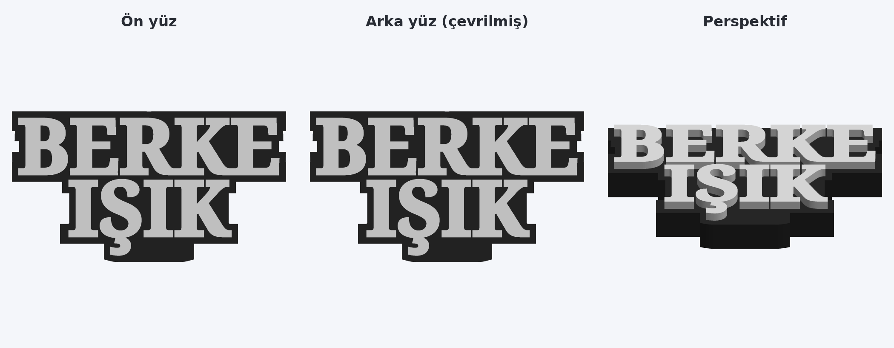

# Çift taraflı isimlik (Bambu Lab)



| Dosya | İçerik |
| --- | --- |
| `BERKE_ISIK_cift_tarafli.3mf` | **Basılacak dosya.** Bambu Studio'da açıp doğrudan dilimleyebilirsin. |
| `orijinal/Two_line_Customizable_Name_Plate.3mf` | MakerWorld Parametric Model Maker'dan gelen tek taraflı orijinal |
| `onizleme.png` | Ön yüz, arka yüz (çevrilmiş hâli) ve perspektif görünüm |

## Ne değişti?

- **Ön yüz aynen duruyor:** 6 mm kabartma beyaz yazı, 20 mm siyah gövde, ölçüler ve tabladaki konum aynı.
- **Arka yüze yazı eklendi:** Aynı yazı, tablaya bakan alt yüze **1 mm derinliğinde gömülü (inlay)** olarak basılıyor.
  Aynalanmış olarak yerleştirildi, isimliği çevirdiğinde **"BERKE / IŞIK" düz okunuyor**.
- **Gövde dış hattı biraz genişledi:** Arka yazının da 4 mm'lik siyah çerçeveyle tam oturması için dış hat, ön ve arka
  yazının dış hatlarının birleşimi yapıldı. "Ş" harfinin alttaki çengeli arka yüzde ters tarafa düştüğü için alttaki iki
  çıkıntı tek bir düzgün çıkıntıda birleştirildi. Orijinalde gövdeyi boydan boya delen küçük harf boşlukları (E'nin kolları
  arası, R'nin içi, K'nin ağzı gibi) artık siyah gövdeyle dolu; arka yazı bu bölgelerden geçtiği için gerekli.
- **Model 3 parçaya ayrıldı** (Bambu Studio'da *Nesneler* listesinde görünür):
  | Parça | Filament |
  | --- | --- |
  | Gövde | 1 (siyah) |
  | Ön Yazı | 2 (beyaz) |
  | Arka Yazı | 2 (beyaz) |

  Rengi değiştirmek istersen parçaya sağ tıklayıp filamentini değiştirmen yeterli.
- Yazıcı, filament ve baskı ayarları (Bambu Lab X2D 0.4, Bambu PLA Basic, 0.20 mm Standard) orijinal dosyadan aynen alındı.

## Baskı

1. `BERKE_ISIK_cift_tarafli.3mf` dosyasını Bambu Studio ile aç (proje olarak yükle), filament 1 = siyah, filament 2 = beyaz olacak şekilde AMS eşleşmesini kontrol et.
2. **Dilimle → Yazdır.** Destek gerekmez (modelde hiç sarkma yok), yapıştırma gerekmez; tek seferde, tek parça basılır.
3. Arka yazı ilk 5 katmanda (0–1 mm) basıldığı için **ilk katmanın temiz yapışması önemli**: tablayı yağsız tut.
   Arka yüzün görünümü tablanın yüzeyini alır — pürüzsüz tabla (Cool Plate / Smooth PEI) parlak ve düz,
   Textured PEI ise mat, dokulu bir arka yüz verir.
4. Baskı bitince isimliği çevir: arka yüzde de yazı düz okunur.

> Not: Dosyada MakerLab bilgileri duruyor; modeli MakerLab'da yeniden düzenlersen tek taraflı hâline döner.
> Farklı bir isim için MakerLab'da yeni isimliği oluşturup aşağıdaki betikle yeniden çift taraflı yapabilirsin.

## Yeniden üretme / başka isim

```bash
pip install numpy manifold3d pillow
python3 scripts/cift_tarafli_isimlik.py isimlik/orijinal/Two_line_Customizable_Name_Plate.3mf \
    isimlik/BERKE_ISIK_cift_tarafli.3mf --onizleme isimlik/onizleme.png
```

- `--derinlik 0.6` gibi bir değerle arka yazının gömülme derinliği değiştirilebilir (katman yüksekliğinin katı olmalı; varsayılan 1.0 mm).
- Betik, MakerWorld "Parametric Model Maker" ile üretilmiş boyalı (gövde + kabartma yazı) isimlik 3MF'lerinde çalışır;
  gövde ve yazı filamentlerini dosyadaki boyamadan kendisi bulur.
