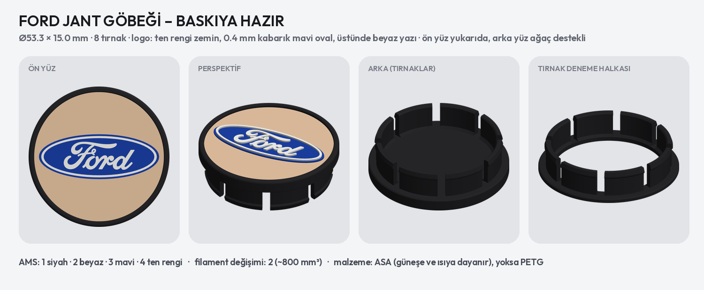
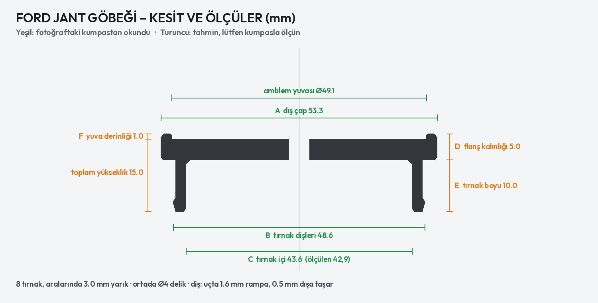

# Ford jant göbeği (Ø53, 8 tırnak, Ford logolu) – Bambu Lab X2D





| Dosya | Ne için |
| --- | --- |
| `ford_jant_gobegi.3mf` | Ford logolu jant göbeği, baskıya hazır (Ø53,3 × 15 mm). AMS: **1 siyah · 2 beyaz · 3 mavi · 4 ten rengi** |
| `tirnak_deneme_halkasi.3mf` | **Önce bunu bas:** yalnız tırnaklar + ince halka. Jante takıp oturuşu dene (~15 dk) |

## Ölçüler

Kumpaslı fotoğraflardan okundu (kesit resminde yeşil):

- Ön yüz dış çapı **53,3 mm** (üç fotoğrafta 52,9 / 53,3 / 53,5)
- Tırnak dişleri dahil dış çap **48,5 mm**, tırnakların iç çapı **42,9 mm**
- **8 tırnak**, aralarında ~3 mm yarık; ön yüzde Ø49 amblem yuvası; Ford ovali ~46 × 17 mm

Fotoğraftan okunamadı, şimdilik tahmin (kesit resminde turuncu):

| | Ölçü | Tahmin | Nasıl ölçülür |
| --- | --- | --- | --- |
| D | Flanş kalınlığı | 5,0 mm | Kapağı yan çevir; ön yüz kenarından tırnakların çıktığı arka yüze |
| E | Tırnak boyu | 10,0 mm | Arka yüzden tırnak ucuna |
| F | Amblem yuvası derinliği | 1,0 mm | Kenar halkasının üstünden yuva tabanına (kumpasın derinlik çubuğu) |
| – | Toplam yükseklik | 15,0 mm | Kapağı yüzüstü koy, masadan tırnak ucuna |
| G | **Jantın göbek deliği çapı** | – | Jantta tırnakların girdiği delik; tırnak sıkılığını bu belirler |

Bu ölçüler gelince `scripts/jant_gobegi.py` dosyasının başındaki `OLCU` değerleri değiştirilir, betik dosyaları
yeniden üretir.

## Baskı

- **Malzeme: ASA** (X2D kapalı kasa, sorunsuz basar). Dört rengin hepsi aynı malzemeden olmalı (ASA ile PLA karışmaz). Güneşte siyah jant 60–70 °C olur; PLA bu sıcaklıkta yumuşar,
  tırnaklar gevşer. ASA yoksa PETG. Dosyada PLA ayarı var: Bambu Studio'da filamenti **Bambu ASA** (ya da PETG) seç,
  doğru sıcaklıklar kendiliğinden gelir.
- **Yön:** Ön yüz yukarıda, tırnak uçları tablada. Böylece ön yüz ve logo desteksiz ve temiz çıkar.
- **Destek:** Dosyada açık: *ağaç destek, yalnız tabladan*. Sadece flanşın arka yüzünün altına (görünmeyen taraf,
  tırnak halkasının içi ve dışı) gelir, elle kolay sökülür.
- **Ayarlar (dosyada):** 3 duvar, %25 dolgu, Arachne, kenar (brim) yok.
- Bir araç için 4 adet: nesneye sağ tıkla → *Örnek ekle* (3 kez) → *Düzenle*.

## Ford logosu

Logo yuvanın içinde, rozet gibi katman katman basılır: ten rengi zemin, mavi oval, beyaz yazı:

| Katman | Renk | Yükseklik |
| --- | --- | --- |
| Zemin (yuva tabanı) | ten rengi | 3 katman, yüzeye gömülü |
| Oval (45,5 × 17 mm) | mavi | 0,4 mm kabarık |
| "Ford" yazısı ve oval çizgisi | beyaz | 0,6 mm, kenar halkasıyla aynı hizada (kenar yazıyı korur) |

- Renkler üst üste geldiği için her katmanda en fazla iki renk var: siyah bir nozulda, ten rengi, mavi ve beyaz
  öbüründe; bütün baskıda yalnız **2 filament değişimi** (ten rengi→mavi→beyaz).
- Ten rengi için bej/krem tonu bir filament (ör. Bambu PLA Basic Beige ya da aynı tonda ASA/PETG). Zemin rengi
  `scripts/jant_gobegi.py` içindeki `ZEMIN_RENK` ile değişir.
- Yazının ince kıvrımları 0,4 nozula göre 0,08 mm kalınlaştırıldı: 0,5 mm'den ince yer kalmadı, çizgi ~0,6 mm.
- Mavi için koyu mavi filament (ör. Bambu ASA Blue / PLA Basic Blue) Ford mavisine en yakın sonucu verir.
- Logo çizimi Simple Icons'tan (`scripts/logolar/ford.svg`, CC0). Ford logosu Ford Motor Company'nin markasıdır.

## Takma

Deneme halkası jantta:
- **Çok sıkıysa ya da girmiyorsa:** diş çapı (`dis_od`) 0,2–0,3 mm küçültülür.
- **Gevşekse ya da düşüyorsa:** diş çapı büyütülür, tırnak boyu (`L`) jantın deliğine göre ayarlanır.

## Yeniden üretme

```bash
python3 scripts/jant_gobegi.py
```
