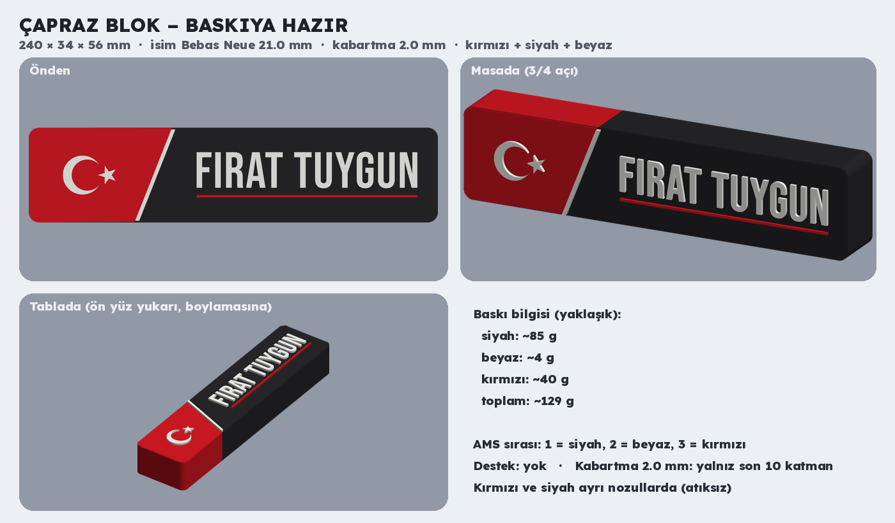
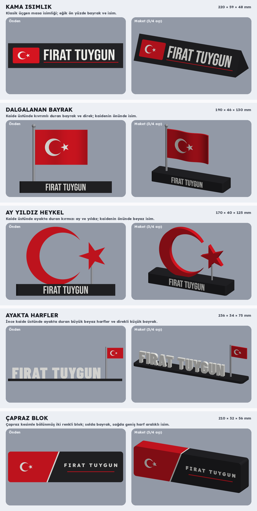

# FIRAT TUYGUN masa isimliği tasarımları (Türk bayraklı)

## Baskıya hazır: çapraz blok



**`capraz_blok.3mf`** – Bambu Studio'da açıp doğrudan dilimlenebilir (Bambu Lab X2D, PLA Basic, 0,20 mm).

| | |
| --- | --- |
| Ölçü | 240 × 34 × 56 mm (genişlik × derinlik × yükseklik; ön yüz kabartması dahil) |
| İsim | Bebas Neue, 21 mm, kalın beyaz; altında kırmızı çizgi |
| Kabartma | 2,0 mm (beyaz ay-yıldız, isim, ayraç ve kırmızı çizgi) |
| Renkler (AMS sırası) | 1 = siyah, 2 = beyaz, 3 = kırmızı (Bambu PLA Basic Red) |
| Filament (yaklaşık) | siyah ~85 g, kırmızı ~40 g, beyaz ~4 g (2 duvar, %15 dolgu) |

Baskı:
- Ön yüz **yukarı** bakacak şekilde yatık basılır, destek gerekmez.
- Kırmızı ve siyah kısımlar bloğun tüm derinliği boyunca sürer. Bambu Studio'da filament eşlemesinde siyah ve kırmızı
  **farklı nozullara** gelmeli (otomatik eşleme temizlemeyi en aza indirmeye çalışır; kontrol et). Böylece katman başına
  temizleme atığı olmaz.
- Beyaz (ay-yıldız, isim, ayraç) ve kırmızı alt çizgi ön yüzde 2,0 mm kabartma: yalnızca son 10 katman.
- X2D'de ikinci nozul tablanın sol 20,5 mm'sine erişemediği için blok tablaya **boylamasına** yerleştirildi.
- İlk katman 0,3 mm içe çekik, ön yüz kenarı 0,6 mm pahlı; nesne ayarında Arachne açık.

Kontroller: parçalar sağlam ve birbirine girmiyor, tek gövde; birbirine 0,6 mm'den yakın öğe yok; ince kısım olarak
kalanlar yalnızca yıldızın ve harflerin sivri uçları.

Yeniden üretme: `python3 scripts/capraz_blok.py`

## İlk tasarım önerileri



Bu klasördeki görseller **tasarım seçimi** içindir. Seçilen tasarım baskıya hazır Bambu Lab (X2D) 3MF dosyasına
çevrilecek. Geometri gerçek ölçülerle (mm) kuruldu, bu yüzden görsellerdeki ölçüler baskıdakiyle aynı olur.

| No | Tasarım | Ölçü (yaklaşık) | Renkler | Baskı notu (3B'ye çevirirken) |
| --- | --- | --- | --- | --- |
| 1 | Kama isimlik | 220 × 59 × 48 mm | siyah, kırmızı, beyaz | Arka yüzü tablada yatırılarak basılır; ön yüz grafikleri en üst katmanlarda renkli olur |
| 2 | Dalgalanan bayrak | 190 × 46 × 130 mm | siyah, kırmızı, beyaz, gri direk | Kaide, kıvrımlı bayrak ve direk ayrı parçalar; bayrak dik basılır (desteksiz), direk kaideye geçmeli |
| 3 | Ay yıldız heykel | 170 × 40 × 125 mm | siyah, kırmızı, beyaz, gri çubuk | Ay ve yıldız dik basılır (desteksiz); kaideye geçmeli yuvalarla takılır |
| 4 | Ayakta harfler | 236 × 34 × 75 mm | siyah, beyaz, kırmızı | Kaide ve harfler tek parça dik basılabilir; bayrak ayrı parça |
| 5 | Çapraz blok | 210 × 32 × 56 mm | kırmızı, siyah, beyaz | Ön yüz yukarı bakacak şekilde yatık basılır; tek parça |

Türk bayrağı resmi oranlarla çizildi: yükseklik G, boy 1,5 G; ayın dış dairesi 0,5 G, iç dairesi 0,4 G çaplı ve
1/16 G kaydırılmış; yıldız 1/4 G çaplı çembere oturur, bir ucu hilale bakar. Kırmızı: #E30A17.

## Yeniden üretme

```bash
pip install numpy manifold3d pillow shapely scipy fonttools uharfbuzz
python3 scripts/masa_isimligi.py
```
